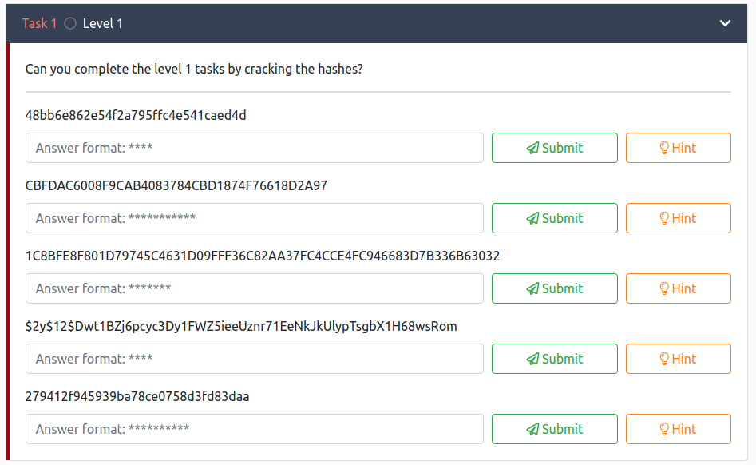
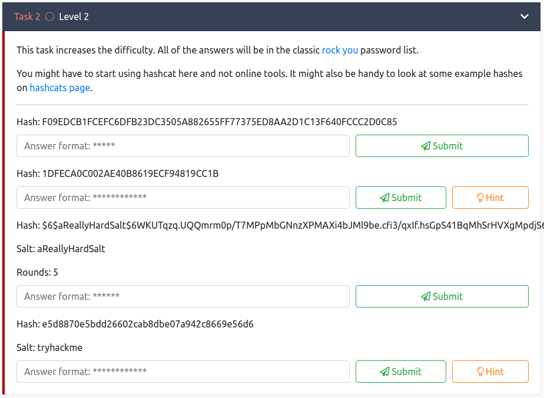

#**Crack the hash**

##**Task 1**  

These hashes are all different types at first glance, so I decided to identify
the hash types before cracking them.

The results were as hash types were as follows:

Hash | Identified Type
------------ | -------------
48bb6e862e54f2a795ffc4e541caed4d | MD5
CBFDAC6008F9CAB4083784CBD1874F76618D2A97 | SHA1
1C8BFE8F801D79745C4631D09FFF36C82AA37FC4CCE4FC946683D7B336B63032 | SHA256
$2y$12$Dwt1BZj6pcyc3Dy1FWZ5ieeUznr71EeNkJkUlypTsgbX1H68wsRom | bcrypt $2*$, Blowfish (Unix)
279412f945939ba78ce0758d3fd83daa | MD4

There are several ways to get this done, and the easiest is to try all hashes on
crackstation and see if there is a password for them already on the site. This has
the benefit of being fast is not requiring any real cracking but, for education
purposes we will go ahead and crack these hashes with good old hashcat. Also, not all hashes can be found on crackstation.

Hash 1 command(MD5):

` hashcat -m 0 -a 0 48bb6e862e54f2a795ffc4e541caed4d /home/wordlist.txt `

Hash 2 command(SHA1):

` hashcat -m 1000 -a 0 CBFDAC6008F9CAB4083784CBD1874F76618D2A97 /home/wordlist.txt `

Hash 3 command(SHA256):

` hashcat -m 1400 -a 0 1C8BFE8F801D79745C4631D09FFF36C82AA37FC4CCE4FC946683D7B336B63032 /home/wordlist.txt `

Hash 4 command(bcrypt $2*$, Blowfish (Unix)):

` hashcat -m 3200 -a 0 hashes.txt /home/wordlist.txt `

Hash 5 command(MD4):

` hashcat -m 900 -a 0 279412f945939ba78ce0758d3fd83daa /home/wordlist.txt `

##**Task 2**  

The following table contains the necessary hash information to get the passwords,
if you have a hard time wrapping your head around what is happening, google the
hash type that is indicated inside the parenthesis, that should help:

Hash | Identified Type | Salt | Rounds
------------ | ------------- | ------------ | ------------
F09EDCB1FCEFC6DFB23DC3505A882655FF77375ED8AA2D1C13F640FCCC2D0C85 | SHA2-256
1DFECA0C002AE40B8619ECF94819CC1B | NTLM
$6$aReallyHardSalt$6WKUTqzq.UQQmrm0p/T7MPpMbGNnzXPMAXi4bJMl9be.cfi3/qxIf.hsGpS41BqMhSrHVXgMpdjS6xeKZAs02 | SHA512CRYPT, $6$ HASH | aReallyHardSalt | 5
e5d8870e5bdd26602cab8dbe07a942c8669e56d6 | SHA1 | tryhackme

Hash 1 command(SHA2-256):

` hashcat -m 1400 -a 0 F09EDCB1FCEFC6DFB23DC3505A882655FF77375ED8AA2D1C13F640FCCC2D0C85 rockyou.txt `

Hash 2 command(NTLM):

` hashcat -m 1000 -a 0 1DFECA0C002AE40B8619ECF94819CC1B rockyou.txt `

Hash 3 command(SHA-512, many rounds, salt: aReallyHardSalt , rounds: 5):

` hashcat -m 1800 -a 0 hash3.txt rockyou.txt `

Hash 4 command(SHA1-salted, salt: tryhackme):

` hashcat -m 110 -a 0 hash4.txt `

NOTE: *I was unsure about the last one, so make sure you google the hash type
and method for cracking if you have any trouble.*
