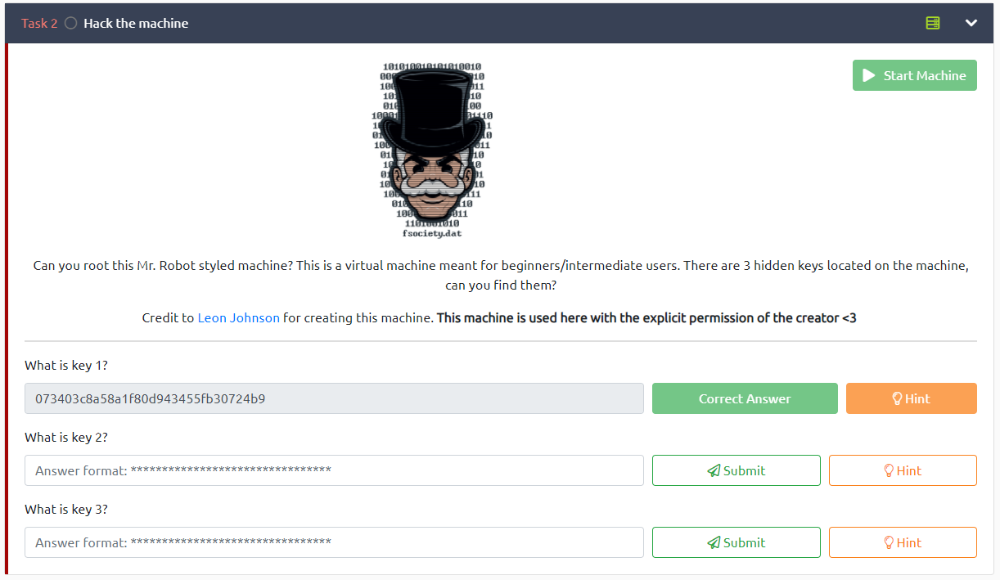

<h1>Mr Robot :fsociety: </h1>

<h2>What is key 1?</h1>

Hint: Robots

This hint should take anyone that has done a few ctfs somewhere fast,
it is a suggestion to go check the robots.txt file of the site:

If you haven' yet, go to browser an put the machine ip address, then
after spending some unfruitful time watching Mr. Robot advertisements(/s) 
you can go ahead and check out the robots.txt of the site:

`MACHINE_IP/robots.txt`

Below is a screenshot of robots.txt:
