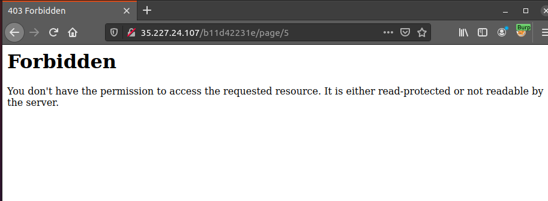
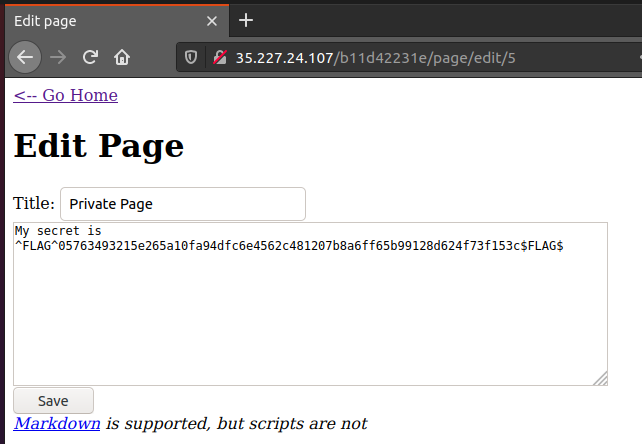

**Flag 1:**

After looking around, we can see that the page is being retrieved via a "page"
id value, after trying to use a ' symbol to identify SQLi vulns on all the
sites that are available, using it on the edit page provides the first Flag

**Flag 2:**

After checking the resulting pages with id's from 1-10, I noticed that all pages
except page 5 returned 404s, page 5 returned 403.

Adding the "/edit" portion of the url to page 5 returned the second flag:

**Flag 3:**
