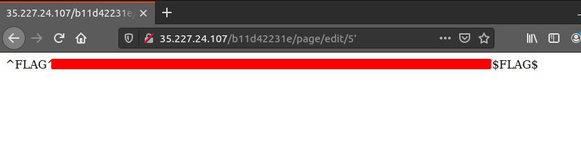

Flag 1:

After looking around, we can see that the page is being retrieved via a "page"
id value, after trying to use a ' symbol to identify SQLi vulns on all the
sites that are available, using it on the edit page provides the first Flag

